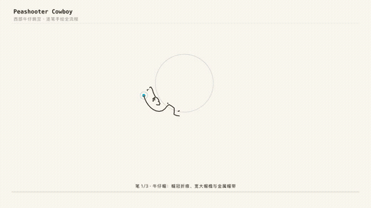

# manim-handdraw

**Turn a line-art bitmap into a progressive hand-drawn animation in Manim.**

Manim can grow a line with `Create()`. What it can't do is look at a PNG and know
*where* the lines are, in *what order* a human would draw them, and how to dress the
process up as a drawing session — compass, construction lines, ink fills, colour washes.
This package wraps that whole pipeline behind a few plain statements.

```python
from manim import *
import manim_handdraw as hd

class Demo(hd.HandDrawScene):
    def construct(self):
        self.hand_draw("lineart.png", color="color.png")
```

That single call extracts the strokes, draws them one at a time with a moving pen
cursor, then washes the colour in strip by strip.



> Demo: the bundled peashooter example, rendered end-to-end by this library.

---

## Install

```bash
pip install manim-handdraw                 # rendering only (manim + numpy)
pip install "manim-handdraw[extract]"      # + the image → strokes pipeline
```

The split is deliberate: extracting strokes needs `scikit-image` / `scipy` / `Pillow`,
but those are **imported lazily, inside functions**. Manim imports every registered
plugin at startup, so keeping the top level clean means installing this package never
slows down unrelated `manim` runs.

## Requirements

- Python ≥ 3.9, Manim ≥ 0.18
- The extract layer additionally needs `scikit-image`, `scipy`, `Pillow`

---

## Quick start

```bash
manim-handdraw demo lineart.png -o my_scene --color color.png
manim -ql my_scene/demo_scene.py Demo
```

Or write it yourself:

```python
from manim import *
import manim_handdraw as hd

config.frame_width, config.frame_height = 16, 9
config.background_color = hd.PAPER

class Demo(hd.HandDrawScene):
    def construct(self):
        self.hand_draw(
            "lineart.png",
            color="color.png",     # or ["green.png", "brown.png", "red.png"]
            size=7.0,              # fits height, same as ImageMobject.scale_to_fit_height
            center=(0.0, 0.0),
            pen_speed=0.9,         # Manim units per second — lower is slower/longer
        )
```

`hand_draw(..., draw=False)` returns the `StrokeSet` instead of playing it, so you can
interleave your own close-ups and geometric constructions. That's exactly what
[`examples/peashooter`](examples/peashooter) does.

---

## What's inside

Three layers, usable independently. Everything is plain Manim — no custom renderer,
no monkey-patching, so it composes with animations you already know.

| Layer | What it gives you | Needs `[extract]`? |
|---|---|---|
| **Extract** | bitmap → ordered stroke paths (`from_image`, `extract_strokes`) | yes |
| **Draw** | `StrokeSet`, `Stylus`, per-stroke timing, `InkBlot` fills | no |
| **Draft** | `Compass`, `trace_ellipse`, construction lines, colour sweep | no |

### Draw — strokes and the pen

```python
strokes = hd.from_image("lineart.png", size=7.0)
print(strokes.describe())
# <StrokeSet 99 strokes, total length 52.4 units ...>

stylus = hd.Stylus()
self.play(*stylus.draw_all(strokes))        # one call, timing auto-distributed
```

`Stylus.draw()` returns `(animations, run_time, mobject)` when you want to control
pacing yourself:

```python
stylus.move_to(strokes[0][0])
self.play(FadeIn(stylus), run_time=0.4)
for p in strokes:
    group, rt, mob = stylus.draw(p)
    self.play(*group, run_time=rt)
```

### Draft — the geometry session

Draw a circle with a compass, sweep out an ellipse from its parametric equation, then
trace it in ink:

```python
# compass: pivot + jointed arms; rotation stays in sync with the circle being drawn
compass = hd.Compass(pivot, radius=0.67)
self.play(FadeIn(compass), run_time=0.5)
anims, guide = compass.draw_circle(dashed=True)
self.play(*anims, run_time=2.6)             # dashed guide reads as "construction"
self.play(FadeOut(compass), run_time=0.5)

# ellipse: auxiliary circle + major/minor axes + a rotating radius arm
info = hd.trace_ellipse(center, a=0.29, b=0.16, tilt=-83.5, show_label="eye")
self.play(*info["anims"], run_time=info["run_time"])
self.play(FadeOut(info["scaffold"]), FadeOut(info["arm"]))

# then: trace it in ink, and let ink bleed out from the centre
self.play(*stylus.retrace(info["points"]))
blot = hd.InkBlot(center, a * 0.97, b * 0.97, tilt=-83.5)
self.play(UpdateFromAlphaFunc(blot, hd.blot_grow))
```

`HandDrawScene` bundles these as `self.construct_ellipse(...)` / `self.construct_circle(...)`.

### Colour — the wash

Splitting a finished image into vertical strips and revealing them in sequence reads as
watercolour soaking across the page, instead of the whole layer popping in:

```python
anim, group = self.sweep_color("color.png", n=7, run_time=3.2)
self.play(anim)
```

The strips are laid out from **exact** pixel boundaries. Rounding each strip's width
leaves ~1px of misalignment between neighbours, which shows up as a thin seam straight
down your character — a bug that is easy to ship and annoying to diagnose.

---

## The extraction pipeline

`from_image()` runs this, then caches the result to `<image>.strokes.npz` so re-renders
cost nothing:

| Step | What happens | Why |
|---|---|---|
| **Ink mask** | alpha channel (or luminance) → boolean | works with transparent PNGs *and* white-background scans |
| **Skeletonize** | thin the ink to a 1-pixel centreline | turns areas into curves while preserving topology |
| **Distance transform** | record local ink half-width along the centreline | lets you approximate the original line weight later |
| **Cut at junctions** | 8-neighbour count ≥ 3 → junction; remove, then label the rest | yields "atomic" segments containing no forks |
| **Walk** | from an endpoint, follow neighbours into an ordered polyline | a stroke must have a start and an end to be drawn |
| **Merge** | join segments whose endpoints are close *and* whose directions are collinear | **also closes the gaps** left at junctions — one pass, two problems solved |
| **Clean** | drop short segments that have no neighbour | removes skeletonisation specks; short segments *with* neighbours are kept, because they are usually real detail that the junction cut fragmented |
| **Sort** | band by row, greedy nearest-neighbour inside each band | draws top-to-bottom, like a person, without jumping left and right |

Segments are resampled by arc length, which simultaneously smooths pixel stair-stepping
and caps the point count.

Two knobs matter most:

```python
hd.extract_strokes(
    "lineart.png",
    merge_gap=9.0,        # px — larger ⇒ fewer, longer strokes
    merge_angle=0.30,     # 0..1 — direction agreement required to merge
    drop_inside=[(cx, cy, a, b, tilt)],   # ellipses to exclude
)
```

---

## CLI — keep heavy deps out of your Manim environment

```bash
manim-handdraw prep lineart.png --strips color.png
manim-handdraw info lineart.strokes.npz
```

```text
骨架 7666 像素 -> 原始分段 204
合并清理 -> 99 段（剔除碎点 0）
已写出 lineart.strokes.npz
  StrokeSet(99 笔，总长 52.4 单位，单笔 0.06~3.21，范围 x[-2.05,2.05] y[-2.80,3.00])
```

Then render anywhere with just `manim` + `numpy`:

```python
strokes = hd.StrokeSet.load("lineart.strokes.npz")
```

---

## Recipes / gotchas

The parts that cost real debugging time. All of them are handled inside the library, but
they bite anyone writing this by hand:

- **`VGroup` cannot hold `ImageMobject`.** Use `Group`. `VGroup` only accepts `VMobject`,
  and the error message doesn't hint at it.
- **Fade the ink layer out once the colour takes over.** Otherwise a later recoil/translation
  of the character slides the colour image but not the line art underneath, and a ghost
  outline leaks out from behind. See `hand_draw()`'s tail.
- **Strip seams from rounding.** Compute strip spans as `round(i*W/n)` and place each strip
  by its exact `[x0, x1]`; never derive position from a per-strip `width * n`.
- **Zooming the camera magnifies your captions too.** Scale the caption by
  `frame.width / config.frame_width` and place it at `camera_center + home * scale`.
  `tag_text()` and `HandDrawScene.zoom_to()` do this.
- **`stroke_width` is not pixels directly.** At 1080p the rendered width is about
  `1.2 × stroke_width` — `3.0 → 3.6px`, `5.0 → 6.0px`.
- **`UpdateFromAlphaFunc` applies `rate_func` for you.** Don't apply it twice.
- **`move_to` needs 3D points.** Stroke arrays are naturally `(n, 2)`; pad them.
- **Solid areas skeletonise into artifacts.** A filled eye becomes one thin line through
  its middle. Detect blobs with `find_solid_blobs()` and hand them to the geometry
  helpers instead.
- **Never name an attribute `points` on a `VMobject` subclass.** `VMobject` already owns
  that name for its raw point array, and it is a property whose setter coerces through
  `np.asarray`. Storing an integer there yields a 0-d array, and the failure surfaces much
  later as `TypeError: only integer scalar arrays can be converted to a scalar index` from
  inside `np.linspace` — with no hint about where the bad value came from.

---

## Examples

| File | Shows |
|---|---|
| [`examples/01_minimal.py`](examples/01_minimal.py) | the one-liner |
| [`examples/02_construct_face.py`](examples/02_construct_face.py) | replacing solid areas with compass/parametric construction |
| [`examples/peashooter/`](examples/peashooter) | the full 2.5-minute video: drawing, close-up construction of eyes and muzzle, colour wash, recoil physics |

```bash
cd examples/peashooter
manim -ql peashooter.py CowboyPea
```

---

## Limitations

Being upfront, because this determines whether it fits your artwork:

- **It does not know what it's looking at.** It sees ink and background. Which strokes form
  "the eyes", where the muzzle centre is, which circle the compass should trace — those are
  yours to supply. The library gives you the measuring tools (`moment_ellipse`,
  `robust_circle_fit`, `find_solid_blobs`) to derive them; the peashooter example shows the
  whole calibration.
- **Best on clean, single-colour line art** with a transparent or white background. Photos,
  textures and anti-aliased grey edges will produce noisy skeletons.
- **Colour wash ≠ layer separation.** You supply the per-layer images; the library slices
  and reveals them.
- **Line weight variation** is measured and stored in `StrokeSet.widths`, but the default
  renderer draws uniform strokes. Draw variable-width ribbons yourself from `widths` if you
  want a brush feel.

---

## License

MIT — see [LICENSE](LICENSE).

Bundled example artwork (`examples/peashooter/assets/`) is released under the same licence.

---

[中文说明 →](README.zh-CN.md)
